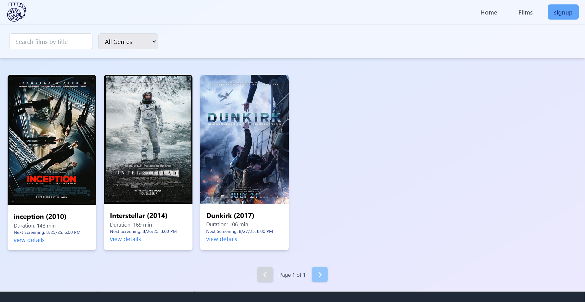
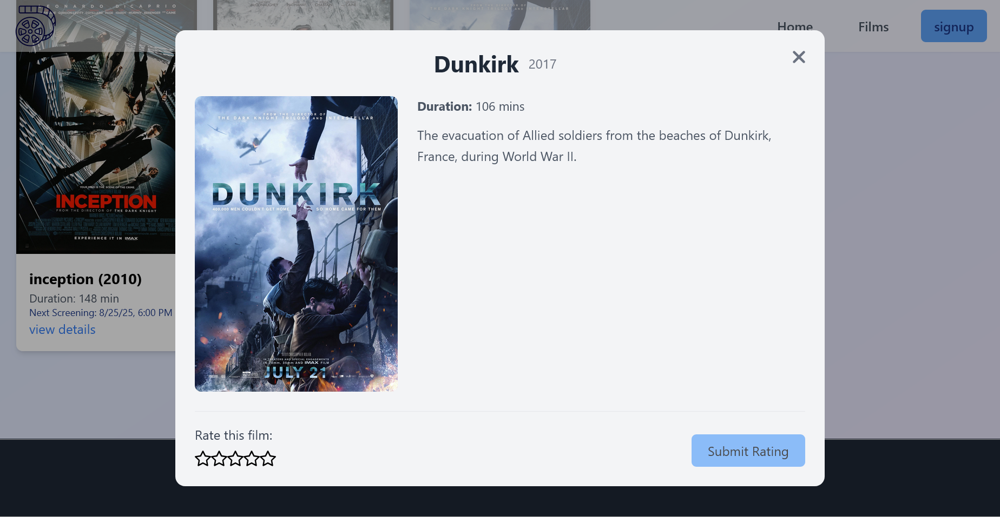

# Films Angular Frontend

This is the frontend application for the Films platform, built using **Angular**. It provides a dynamic and responsive interface for customers to explore movies and manage their profiles.

---

## Features

1. **Browse Movies**

   - View a list of available movies and their details.
   - 

2. **Upcoming Screenings**

   - Explore upcoming screenings and book tickets.
   - 

3. **Rate Movies**

   - Provide ratings and feedback for movies.
   - 

4. **User Authentication**

   - **Login:** Access your account securely.
     - 
     - 
   - **Signup:** Create a new account easily.
     - 

   5. **Mobile Experience**
      - 
      - 

---

## Technologies Used

- **Angular**
- **TypeScript**
- **tailwind**
- **ngrx/signals**
- **primeNG**

---

## Backend Integration

This application interacts with the backend API provided by the **Films Spring Boot** project. For more details, visit the backend repository:  
[Films Spring Boot](https://github.com/Kaouthar15/Films_SpringBoot)
